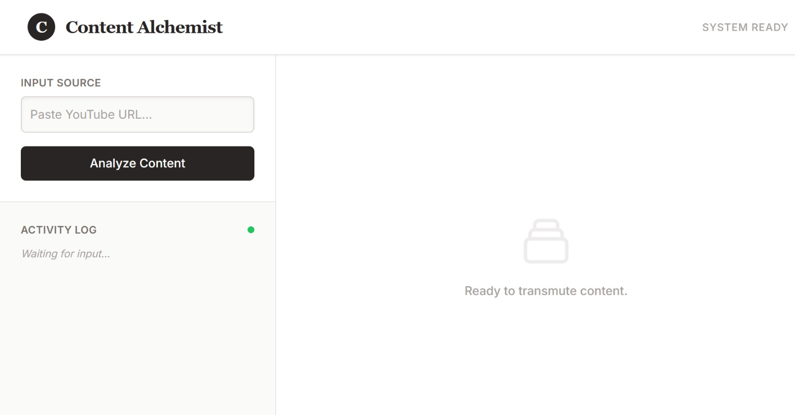
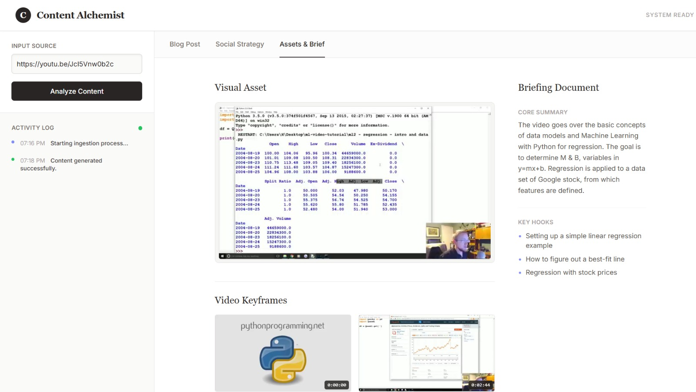

# Content Alchemist 

Automating the Creator Economy through Multimodal AI Agent Orchestration

Content Alchemist represents a sophisticated, autonomous framework designed to mitigate the inefficiencies inherent in content distribution workflows within the creator economy. The system functions as an intelligent pipeline that ingests a singular raw video asset (specifically a YouTube URL) and orchestrates a consortium of specialized AI agents. These agents collaboratively transmute the source material into a comprehensive suite of high-quality distribution assets, including Search Engine Optimized (SEO) articles, strategic social media threads, newsletters, and curated visual keyframes.

## Project Dashboard



The interface is designed with a minimalist "Paper & Ink" aesthetic to facilitate the efficient management of content generation processes.



The system automatically extracts visual keyframes and synthesizes a comprehensive content brief to guide downstream generation tasks.

## Core Functionality

**Multimodal Ingestion Capabilities:** The system utilizes a bespoke MediaIngestionTool, integrated with yt-dlp and OpenCV, to facilitate the direct acquisition of video content and the extraction of visual context (keyframes). This capability ensures that the artificial intelligence analyzes the visual components of the presentation in conjunction with the auditory transcript, thereby achieving a holistic understanding of the source material.

**Sequential Orchestration Strategy:** To ensure system stability and strict adherence to API rate limits—particularly within the constraints of free-tier access—the architecture employs a sequential orchestration pattern. This approach manages distinct computational tasks, such as research, drafting, and strategy formulation, in a linear progression rather than concurrent execution.

**Context Compaction and Efficiency:** To mitigate the computational cost of repeatedly processing raw video data, the system generates a "Master Content Brief" upon initial ingestion. This lightweight JSON object functions as the definitive source of truth for all subsequent agents, thereby reducing redundancy and enhancing the consistency of the generated outputs.

**Intelligent Visual Asset Selection:** The architecture includes an automated mechanism for extracting high-resolution screenshots at equidistant intervals. It subsequently employs selection logic to identify the optimal video frame for utilization as the primary visual asset, ensuring relevant imagery is available without reliance on external stock photography.

**User Interface:** The application features a streamlined web dashboard that allows users to monitor generation results, observe real-time server logs, and retrieve generated assets efficiently.

## System Architecture

The Content Alchemist operates via a robust sequential pipeline designed to maximize reliability:

1. **Ingestion Tool:** This component executes the retrieval of the video file and utilizes computer vision libraries to extract four representative keyframes.

2. **Analysis Agent:** The extracted media is uploaded to the Google Gemini 2.0 Flash (Experimental) model. The agent analyzes both the audio transcript and the visual frames to synthesize a Master Content Brief.

3. **Worker Agents:**
   - **Blog Agent:** Composes a comprehensive article formatted in Markdown, structured specifically for SEO performance.
   - **Social Agent:** Drafts professional posts suitable for LinkedIn and threaded narratives for Twitter/X.
   - **Newsletter Agent:** Synthesizes a concise summary of the content, inclusive of a clear Call to Action (CTA).

4. **Asset Processor:** This module evaluates the extracted video frames to select and package the most appropriate image as the primary visual asset for the content suite.

## Installation and Configuration

### Prerequisites

- Python 3.10 or higher.
- FFmpeg: Must be installed and added to the system PATH to enable video processing capabilities.
- Google AI Studio API Key: Required for authentication with the Gemini API.

### Setup Procedure

**Clone the Repository:**
```bash
git clone https://github.com/yourusername/content-alchemist.git
cd content-alchemist
```

**Initialize the Virtual Environment:**

```bash
python -m venv venv
# For Windows
venv\Scripts\activate
# For Mac/Linux
source venv/bin/activate
```

**Install Dependencies:**

```bash
pip install -r requirements.txt
```

**Configure Environment Variables:**
Create a .env file in the root directory and populate it with your API key:

```
GOOGLE_API_KEY=your_actual_api_key_here
```

## Operational Guidelines

**Initialize the Backend Server:**

Execute the following command to start the application:

```bash
python src/app.py
```

The terminal will indicate when the server is operational.

**Access the Dashboard:**
Launch a web browser (Google Chrome or Brave is recommended) and navigate to the local host:
```
http://localhost:5000
```

**Execute Content Generation:**

- Input a valid YouTube URL (e.g., a technical tutorial or academic lecture).
- Select the "Analyze Content" button.
- Monitor the Activity Log to observe the sequential processing of the video.
- Review the generated Blog, Social Strategy, and Assets within the respective tabs upon completion.

## Output Directory Structure

While generated content is accessible via the user interface, it is also persisted to the local disk within the output directory, organized as follows:

```
content-alchemist/
├── output/
│   ├── blogs/         # Generated Markdown blog posts
│   ├── social/        # Social media strategy drafts
│   ├── newsletter/    # Newsletter summaries
│   ├── assets/        # Selected header images
│   └── temp_media/    # Extracted video keyframes
```


## Troubleshooting

**429 Quota Exceeded:** The system implements an automated exponential backoff strategy (pausing for 10 seconds, then 20 seconds, etc.) to manage API rate limits. If this error appears in the logs, the system will attempt to retry the operation automatically.

**FFmpeg Error:** Ensure that FFmpeg is correctly installed and accessible from the command line interface. Verify the installation by executing `ffmpeg -version`.

**Download Warnings:** The terminal may display warnings regarding "PO Tokens." These notifications are managed internally by the ingestion tool and do not impede the download process.

## License

This project is licensed under the MIT License.